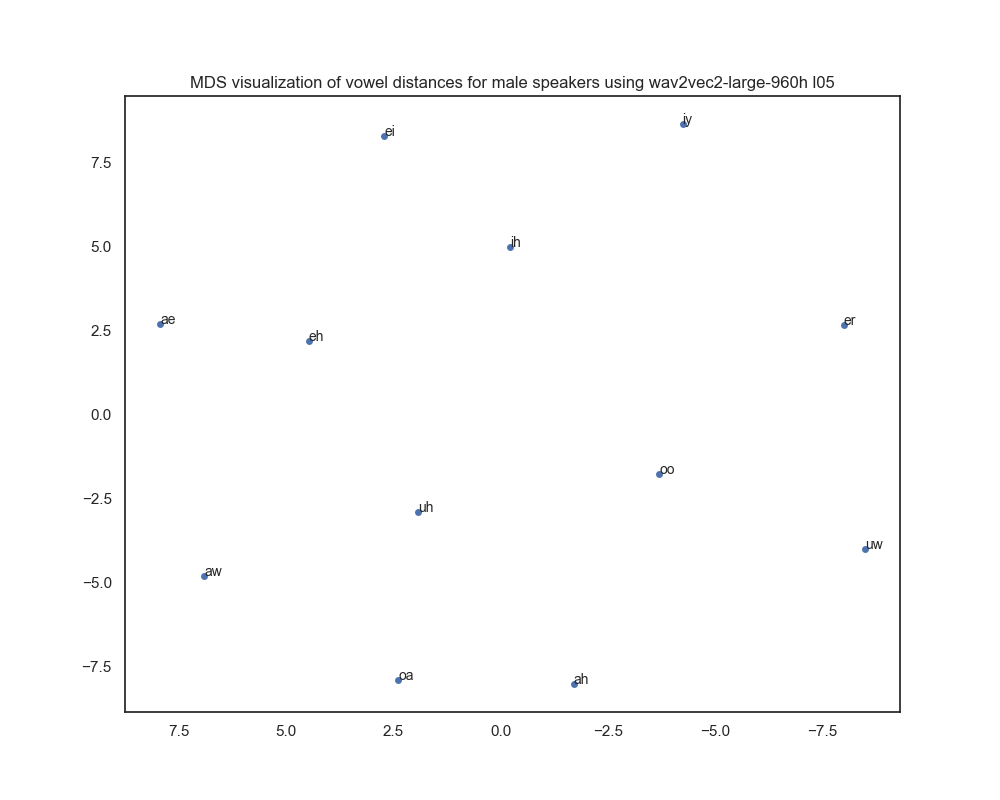

# Compute acoustic distances between vowels

Q: A lot of work over the past decade shows that features derived from acoustic embeddings are a better source for most sound-analysis tasks than frame-wise spectral analyses.
But we don't yet know how to create low-dimensional versions that express exactly the information relevant to (e.g.) vowel quality.

This repository compares a formant-based approach to a neural embedding-based approach for computing vowel distances on the [Hillenbrand et al. (1995)](https://pubs.aip.org/asa/jasa/article/97/5/3099/847219/Acoustic-characteristics-of-American-English) dataset.

## Repository Structure

### `/dist_mats/hillenbrand` Directory

| Subdirectory | Description |
|--------------|-------------|
| `formants` | Subdirectory contains matrices with vowel distances per gender computed using the formant-based approach. |
| `wav2vec2-large-960h` | Subdirectory contains matrices with vowel distances per gender for layers [1, 5, 10, 15, 20, 24], computed using the embedding-based approach and [wav2vec2-large-960h](https://huggingface.co/facebook/wav2vec2-large-960h). |
| `wav2vec2-xls-r-300m` | Subdirectory contains matrices with vowel distances per gender for layers [1, 5, 10, 15, 20, 24], computed using the embedding-based approach and [wav2vec2-xls-r-300m](https://huggingface.co/facebook/wav2vec2-xls-r-300m). |
| `wav2vec2-xls-r-1b` | Subdirectory contains matrices with vowel distances per gender for layers [1, 5, 10, 15, 20, 24, 28, 32, 36, 40, 44, 48], computed using the embedding-based approach and [wav2vec2-xls-r-1b](https://huggingface.co/facebook/wav2vec2-xls-r-1b). |

### `/plots/hillenbrand` Directory

| Subdirectory | Description |
|--------------|-------------|
| `formants` | Subdirectory contains 2D MDS visualizations of matrices with vowel distances per gender computed using the formant-based approach. |
| `wav2vec2-large-960h` | Subdirectory contains 2D MDS visualizations of matrices with vowel distances per gender for layers [1, 5, 10, 15, 20, 24], computed using the embedding-based approach and [wav2vec2-large-960h](https://huggingface.co/facebook/wav2vec2-large-960h). |
| `wav2vec2-xls-r-300m` | Subdirectory contains 2D MDS visualizations of matrices with vowel distances per gender for layers [1, 5, 10, 15, 20, 24], computed using the embedding-based approach and [wav2vec2-xls-r-300m](https://huggingface.co/facebook/wav2vec2-xls-r-300m). |
| `wav2vec2-xls-r-1b` | Subdirectory contains 2D MDS visualizations of matrices with vowel distances per gender for layers [1, 5, 10, 15, 20, 24, 28, 32, 36, 40, 44, 48], computed using the embedding-based approach and [wav2vec2-xls-r-1b](https://huggingface.co/facebook/wav2vec2-xls-r-1b). |

### `/scripts` Directory

| File | Description |
|------|-------------|
| `extract_feats.py` | Script to extract deep neural embeddings from a specified deep neural model. |
| `acoustic_distance_formants.py` | Script to compute formant-based acoustic vowel distances. |
| `acoustic_distance.py` | Script to compute neural embedding-based acoustic vowel distances. |
| `cor.py` | Script to compute the correlation between formant-based and neural embedding-based vowel distances. |

## Data

We use data from [Hillenbrand et al. (1995)](https://pubs.aip.org/asa/jasa/article/97/5/3099/847219/Acoustic-characteristics-of-American-English).

Recordings of vowels in h-V-d syllables were made by 45 men and 48 women.

| Vowel | Example |
|-------|---------|
| ae    | had     |
| ah    | hod (the vowel in "cot") |
| aw    | hawed   |
| eh    | head    |
| er    | heard   |
| ey    | hayed   |
| ih    | hid     |
| iy    | heed    |
| oa    | hoed (/o/ as in "boat") |
| oo    | hood    |
| uh    | hud     |
| uw    | who'd   |

## Models

- [wav2vec2-large-960h](https://huggingface.co/facebook/wav2vec2-large-960h): wav2vec 2.0 large model with 24 layers, pre-trained and fine-tuned for ASR on 960 hours of Librispeech. This is the best-performing model in [Bartelds et al. (2022)](https://www.sciencedirect.com/science/article/pii/S0095447022000122).
- [wav2vec2-xls-r-300m](https://huggingface.co/facebook/wav2vec2-xls-r-300m): wav2vec 2.0 large model with 24 layers, pre-trained on 436k hours of speech in 128 languages.
- [wav2vec2-xls-r-1b](https://huggingface.co/facebook/wav2vec2-xls-r-1b): wav2vec 2.0 large model with 48 layers, pre-trained on 436k hours of speech in 128 languages.
- More models will be evaluated.

## Usage

### Formant-based approach

```bash
python acoustic_distance_formants.py -i timedata.tsv -g woman
```

Enter the corresponding file with formant frequencies after the input (`-i`) argument, and choose the the gender for which the script should calculate vowel distances (`-g`).

After filtering the data based on the specified gender, the script computes the average pairwise Bark-scaled formant distances between different vowels, following [Wieling et al. (2011)](https://www.clinjournal.org/clinj/article/view/10). The choice of the Bark scale, as opposed to Hertz, aligns better with human perception due to the non-linear nature of frequency perception, as explained in [Traunmüller (1990)](https://pubs.aip.org/asa/jasa/article/88/1/97/626881/Analytical-expressions-for-the-tonotopic-sensory). This approach ensures that the first formant is appropriately weighted in the analysis.

The script then uses multidimensional scaling (MDS) to visualize the computed distances in a 2D space.

The MDS visualization helps in understanding the variation in formant-based vowel distances for the selected gender and can be compared to the [IPA vowel chart](https://www.ipachart.com).

### Embedding-based approach

#### Extract features

```bash
python extract_features.py -m wav2vec2-large-960 -l 10
```

Compute deep neural embeddings for calculating vowel distances.

Works with any `w2v2` or `XLS-R` model available on the [Huggingface Hub](https://huggingface.co/models?search=wav2vec2) 🤗 .

Enter the corresponding model name after the model (`-m`) argument, and choose the output layer using the layer argument (`-l`).

#### Compute vowel distances

```bash
python acoustic_distance.py -i timedata.tsv -g woman -a feats/{model}/{speaker}/layer-{layer}.npy -m wav2vec2-large-960h -l 10
```

Enter the corresponding file with formant frequencies after the input (`-i`) argument for gathering speaker ids, and choose the the gender for which the script should calculate vowel distances (`-g`).

In addition, enter the path to the computed features (`-a`), and select the model (`-m`) and corresponding layer (`-l`) to use for computing the vowel distances.

The computation of the vowel distances are performed in line with [Bartelds et al. (2022)](https://www.sciencedirect.com/science/article/pii/S0095447022000122).

### Compute correlations

```bash
python cor.py -g woman -m wav2vec2-large-960 -l 10
```

This script loads two types of vowel distance matrices (from formants and deep neural embeddings), normalizes and flattens the matrices, then calculates and prints the Pearson's correlation between them.

It takes the gender (`-g`), model type (`-m`), and layer number (`-l`) as arguments to specify the data to use.

## Results

### MDS plots

For embedding-based vowel distances, plots are shown for best-performing layers per model.

Plots for the other layers of the deep neural models are in `/dist_mats/hillenbrand`.

<table>
  <tr>
    <td>
      <a href="./plots/hillenbrand/formants/MDS_vowels_woman.png">
      </a><br>
      MDS visualization of formant-based vowel distances for woman speakers
    </td>
    <td>
      <a href="./plots/hillenbrand/formants/MDS_vowels_male.png">
      </a><br>
      MDS visualization of formant-based vowel distances for male speakers
    </td>
      <td>
      <a href="./plots/hillenbrand/formants/MDS_vowels_both.png">
      </a><br>
      MDS visualization of formant-based vowel distances for both genders
    </td>
  </tr>
  <tr>
    <td>
      <a href="./plots/hillenbrand/wav2vec2-large-960h/l-05/MDS_vowels_woman.png">
      </a><br>
      MDS visualization of wav2vec2-large-960h layer 5-based vowel distances for woman speakers
    </td>
    <td>
      <a href="./plots/hillenbrand/wav2vec2-large-960h/l-05/MDS_vowels_male.png">
      </a><br>
      MDS visualization of wav2vec2-large-960h layer 5-based vowel distances for male speakers
    </td>
      <td>
      <a href="./plots/hillenbrand/wav2vec2-large-960h/l-05/MDS_vowels_both.png">
      </a><br>
      MDS visualization of wav2vec2-large-960h layer 5-based vowel distances for both genders
    </td>
  </tr>
  <tr>
    <td>
      <a href="./plots/hillenbrand/wav2vec2-xls-r-300m/l-10/MDS_vowels_woman.png">
      </a><br>
      MDS visualization of wav2vec2-xls-r-300m layer 10-based vowel distances for woman speakers
    </td>
    <td>
      <a href="./plots/hillenbrand/wav2vec2-xls-r-300m/l-10/MDS_vowels_male.png">
      </a><br>
      MDS visualization of wav2vec2-xls-r-300m layer 10-based vowel distances for male speakers
    </td>
      <td>
      <a href="./plots/hillenbrand/wav2vec2-xls-r-300m/l-10/MDS_vowels_both.png">
      </a><br>
      MDS visualization of wav2vec2-xls-r-300m layer 10-based vowel distances for both genders
    </td>
  </tr>
  <tr>
    <td>
      <a href="./plots/hillenbrand/wav2vec2-xls-r-1b/l-10/MDS_vowels_woman.png">
      </a><br>
      MDS visualization of wav2vec2-xls-r-1b layer 10-based vowel distances for woman speakers
    </td>
    <td>
      <a href="./plots/hillenbrand/wav2vec2-xls-r-1b/l-10/MDS_vowels_male.png">
      </a><br>
      MDS visualization of wav2vec2-xls-r-1b layer 10-based vowel distances for male speakers
    </td>
  </tr>
</table>

### Correlations

| Layer (gender)      | wav2vec2-large-960h  | wav2vec2-xls-r-300m  | wav2vec2-xls-r-1b  |
|---------------------|----------------------|----------------------|--------------------|
| Layer 1 (Male)      | 0.76                 | 0.79                 | 0.82               |
| Layer 5 (Male)      | 0.77                 | 0.85                 | 0.81               |
| Layer 10 (Male)     | 0.69                 | **0.85** (best)      | 0.84               |
| Layer 15 (Male)     | 0.69                 | 0.82                 | 0.79               |
| Layer 20 (Male)     | 0.73                 | 0.83                 | 0.76               |
| Layer 24 (Male)     | 0.73                 | 0.74                 | 0.74               |
| Layer 28 (Male)     |                      |                      | 0.74               |
| Layer 32 (Male)     |                      |                      | 0.73               |
| Layer 36 (Male)     |                      |                      | 0.81               |
| Layer 40 (Male)     |                      |                      | 0.81               |
| Layer 44 (Male)     |                      |                      | 0.68               |
| Layer 48 (Male)     |                      |                      | 0.50               |
| Layer 1 (Female)    | 0.71                 | 0.74                 | 0.73               |
| Layer 5 (Female)    | 0.72                 | 0.80                 | 0.75               |
| Layer 10 (Female)   | 0.70                 | **0.82** (best)      | 0.79               |
| Layer 15 (Female)   | 0.67                 | 0.79                 | 0.77               |
| Layer 20 (Female)   | 0.70                 | 0.81                 | 0.74               |
| Layer 24 (Female)   | 0.71                 | 0.69                 | 0.71               |
| Layer 28 (Female)   |                      |                      | 0.70               |
| Layer 32 (Female)   |                      |                      | 0.69               |
| Layer 36 (Female)   |                      |                      | 0.78               |
| Layer 40 (Female)   |                      |                      | 0.76               |
| Layer 44 (Female)   |                      |                      | 0.65               |
| Layer 48 (Female)   |                      |                      | 0.52               |
| Layer 1 (Both)      | 0.73                 | 0.76                 |                    |
| Layer 5 (Both)      | 0.73                 | 0.82                 |                    |
| Layer 10 (Both)     | 0.68                 | **0.83** (best)      |                    |
| Layer 15 (Both)     | 0.67                 | 0.80                 |                    |
| Layer 20 (Both)     | 0.70                 | 0.81                 |                    |
| Layer 24 (Both)     | 0.71                 | 0.71                 |                    |
